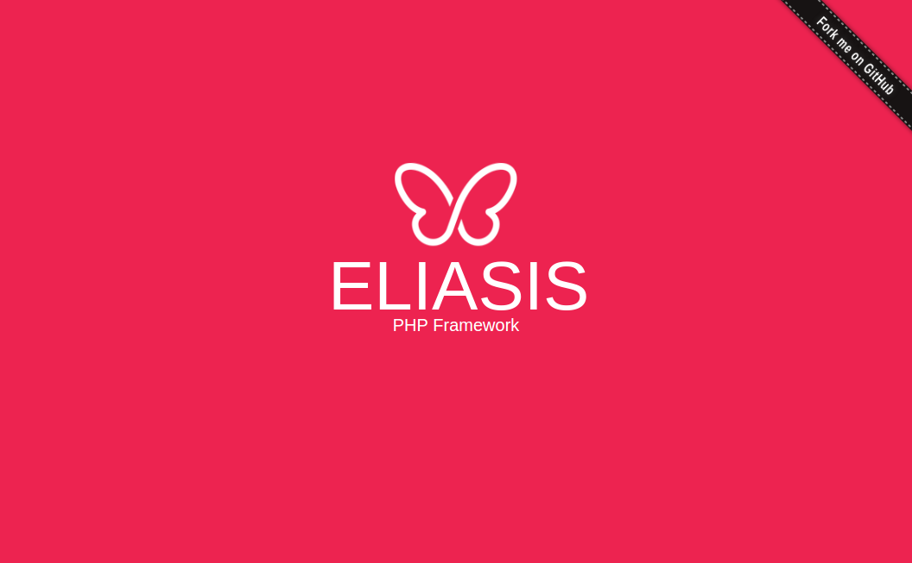

# Eliasis PHP Framework

[](https://packagist.org/packages/eliasis-framework/eliasis) [](https://packagist.org/packages/eliasis-framework/eliasis) [](https://packagist.org/packages/eliasis-framework/eliasis) [](https://packagist.org/packages/eliasis-framework/eliasis)

[Spanish version](README-ES.md)



---

- [Installation](#installation)
- [Requirements](#requirements)
- [Quick Start and Examples](#quick-start-and-examples)
- [Contribute](#contribute)
- [Licensing](#licensing)
- [Copyright](#copyright)

---

### Installation

You can install Eliasis PHP Framework into your project using [Composer](http://getcomposer.org/download/). If you're starting a new project, we
recommend using the [basic app](https://github.com/eliasis-framework/app) as
a starting point. For existing applications you can run the following:

    $ composer require eliasis-framework/eliasis

The previous command will only install the necessary files, if you prefer to download the entire code you can use:

    $ composer require eliasis-framework/eliasis-framework --prefer-source

You can also clone the complete repository with Git:

	$ git clone https://github.com/Eliasis-Framework/Eliasis.git

### Requirements

This framework is supported by PHP versions 5.6 or higher and is compatible with HHVM versions 3.0 or higher.

### Quick Start and Examples

To use this framework, simply:

```php
$DS = DIRECTORY_SEPARATOR;

require dirname(__DIR__) . $DS . 'lib' . $DS . 'vendor' . $DS .'autoload.php';

use Eliasis\App\App;

new App(dirname(__DIR__));
```

### Contribute
1. Check for open issues or open a new issue to start a discussion around a bug or feature.
1. Fork the repository on GitHub to start making your changes.
1. Write one or more tests for the new feature or that expose the bug.
1. Make code changes to implement the feature or fix the bug.
1. Send a pull request to get your changes merged and published.

This is intended for large and long-lived objects.

### Licensing

This project is licensed under **MIT license**. See the [LICENSE](LICENSE) file for more info.

## Copyright

2017 Josantonius, [josantonius.com](https://josantonius.com/)

If you found this release useful please let the author know! Follow on [Twitter](https://twitter.com/Josantonius).